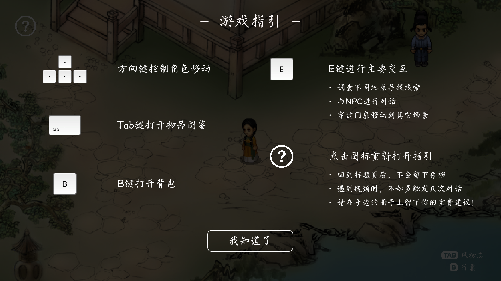
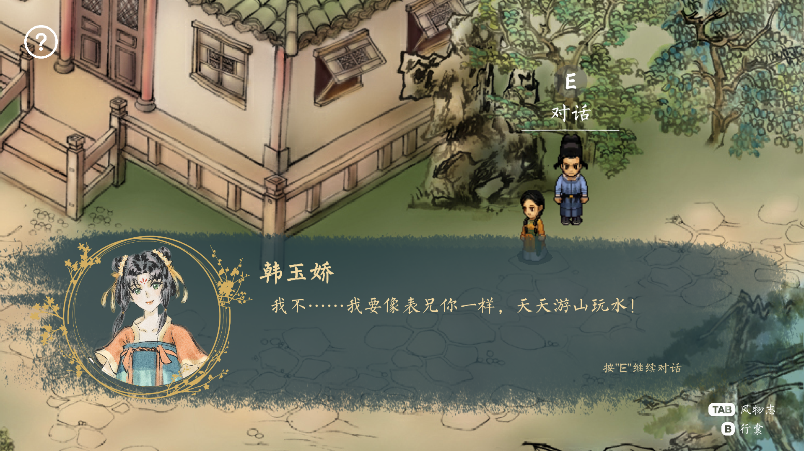
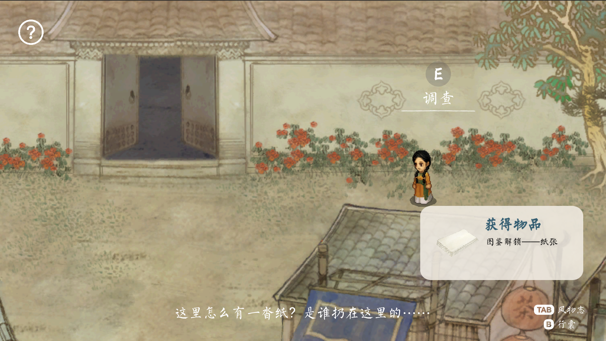

# Journey To Chang'an

## Project Statement
Journey to Chang’an is a 2D serious game that aims to raise players’ interest in the culture and history of the Tang Dynasty. Different from many cultural heritage digitalization project which often offer overwhelming text or visuals for audience to intercept, this game enhances emergent game mechanics to incorporate the cultural contents in dispersive interactions. Players could experience over ten different storylines and explore various collectable items in the game to know what life in the Tang Dynasty could be like in immersive situations.

## Working Document
[Documentation Blog](https://www.notion.so/Capstone-2-8fdb317e2d3742f49901aa9076f5d2c2)

## Staff List
·策划 Overall Design：包包
·程序 Engineering： 包包
·人文/剧情设计 Culture/Story Design：包包
·界面设计 UI Design：包包
·美术编辑 Graphic Editor：包包
·任务/物品设计 Quest/Item Design：包包
·声音设计/音乐 Sound Design/Music：包包
·测试开发 Test： 包包
·指导 Instructing：NYU Shanghai IMA Team
·特别感谢 Special Thanks: Chen Meiling, Zhao Lu

## Citation
  #### -Visual Assets-
  ·Title Page Background：《千里江山图》
  ·Map Backgrounds：[爱给网](https://www.aigei.com/view/70312.html)
  ·Character walking figures: [爱给网](https://www.aigei.com/view/287.html)
                             《轩辕剑》 - 大宇资讯
  ·Item Profile Pictures：香囊 - 成都博物馆
                          剪刀 - 大英博物馆
                          其他物品 - [千库网](https://588ku.com/)

  #### -Visual Assets-                        
  ·Cultural Research Resources：《中国古舆服论丛》
                                《隋唐人的日常生活》

## Screenshots

## Links
  #### -Project Wechat Video Account-
  

  #### -Cultural Research Notes-
  [Google Drive](https://drive.google.com/file/d/1OFF9lQzE6tWmv5ry3WscFmPkEY4-LP24/view?usp=sharing)

  #### -All Dialogue Scripts-
  [Google Sheet](https://docs.google.com/spreadsheets/d/1qwXmXgKnK1-vpbHM_FORp7HPfdSxIoZjqeRIubEuI0Q/edit?usp=sharing)

## Version history
2021.05.16 v1.0: The first published version!
