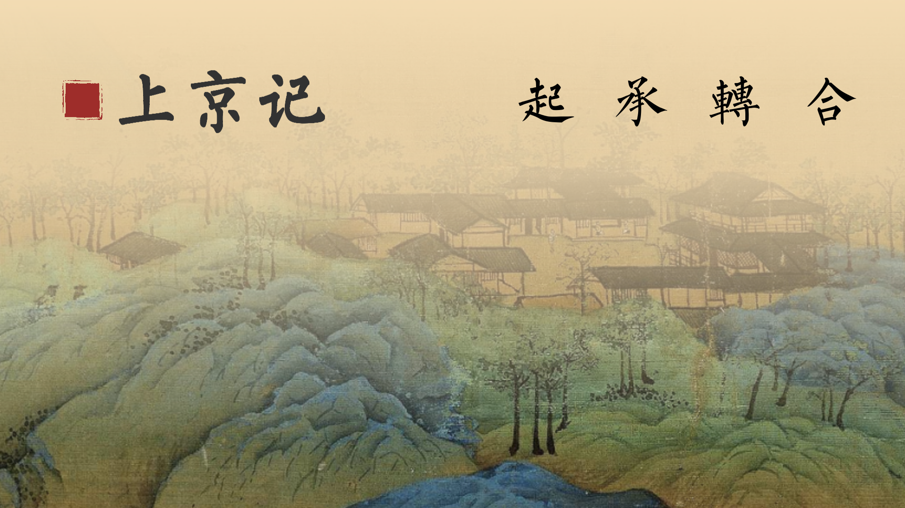

# Journey To Chang'an 上京记

## Gane Link
[Unity Play](https://play.unity.com/mg/other/web-jhxqr)

## Project Statement
Journey to Chang’an is a 2D serious game that aims to raise players’ interest in the culture and history of the Tang Dynasty. Different from many cultural heritage digitalization project which often offer overwhelming text or visuals for audience to intercept, this game enhances emergent game mechanics to incorporate the cultural contents in dispersive interactions. Players could experience over ten different storylines and explore various collectable items in the game to know what life in the Tang Dynasty could be like in immersive situations.

## Abstract
Speaking of cultural heritage, a universal agreement is that they are part of the heritage of a group or individuals, and they can contain various tangible or intangible contents including artworks, historical sites, traditions, rituals, and so on. As digital technology has developed into an interconnected era, more and more practices are being taken in new media approaches to protect and propagate cultural heritage. Serious games, sometimes called applied games, are one of those new media approaches that contribute to the digitalization trend of cultural heritage protection in their unique relaxing way. The definition of serious games is still blurry and controversial, but a common understanding is that they are games that do not have entertainment, enjoyment, or fun as their primary purpose.

This project, Journey to Chang’an, then comes from the question: why do many serious games related to cultural heritage lack engagement? I tried to solve this problem by grabbing ideas from successful commercial games. From my research, some useful methods including emergent game mechanics and multi-media interactions are concluded. So this game actually serves as the application of these methods to make serious games more interesting and engaging. 

So I studied a lot of history materials, broke up the long introductions about cultural heritage in the museum, and integrated them into different storylines. Different from many cultural heritage digitization projects which often offer overwhelming text or visuals for the audience to intercept, this game enhances emergent game mechanics to incorporate the cultural contents in dispersive interactions. What’s more, I spent a lot of time designing sound, music, collection interfaces, etc. Hopefully through the combination of contents in various media formats, people can stay interested in the game thus get to know more about the cultural message behind the gameplay.

## Working Document
[Documentation Blog](https://www.notion.so/Capstone-2-8fdb317e2d3742f49901aa9076f5d2c2)

## Staff List
·策划 Overall Design：包包

·程序 Engineering： 包包

·人文/剧情设计 Culture/Story Design：包包

·界面设计 UI Design：包包

·美术编辑 Graphic Editor：包包

·任务/物品设计 Quest/Item Design：包包

·声音设计/音乐 Sound Design/Music：包包

·测试开发 Test： 包包

·指导 Instructing：NYU Shanghai IMA Team

·特别感谢 Special Thanks: Chen Meiling, Zhao Lu

## Citation
  #### -Visual Assets-
  ·Title Page Background：《千里江山图》

  ·Map Backgrounds：[爱给网](https://www.aigei.com/view/70312.html)

  ·Character walking figures: [爱给网](https://www.aigei.com/view/287.html)
                             《轩辕剑》 - 大宇资讯

  ·Item Profile Pictures：香囊 Perfume  Bag- Chengdu Museum
                          剪刀 Scissors - the British Museum
                          Other Items - [千库网](https://588ku.com/)

  #### -Cultural Documents-                        
  ·Cultural Research Resources：《中国古舆服论丛》
                                《隋唐人的日常生活》
                                
  #### -Game Engine-
  Unity

## Screenshots

## Links
  #### -Project Wechat Video Account-
  

  #### -Cultural Research Notes-
  [Google Drive](https://drive.google.com/file/d/1OFF9lQzE6tWmv5ry3WscFmPkEY4-LP24/view?usp=sharing)

  #### -All Dialogue Scripts-
  [Google Sheet](https://docs.google.com/spreadsheets/d/1qwXmXgKnK1-vpbHM_FORp7HPfdSxIoZjqeRIubEuI0Q/edit?usp=sharing)
  
  #### -Design Highlights Video-
  [Youtube](https://youtu.be/LSqLGmzKOhQ)
  
  #### -Complete Game Walkthrough-
  [Youtube](https://youtu.be/s9bPxK5pXbo)
  
  #### -Music Audition: Flowers in the Wind-
  [Youtube](https://youtu.be/80P3OolN92g)

## Version history
2021.05.16 v1.0: The first published version!
